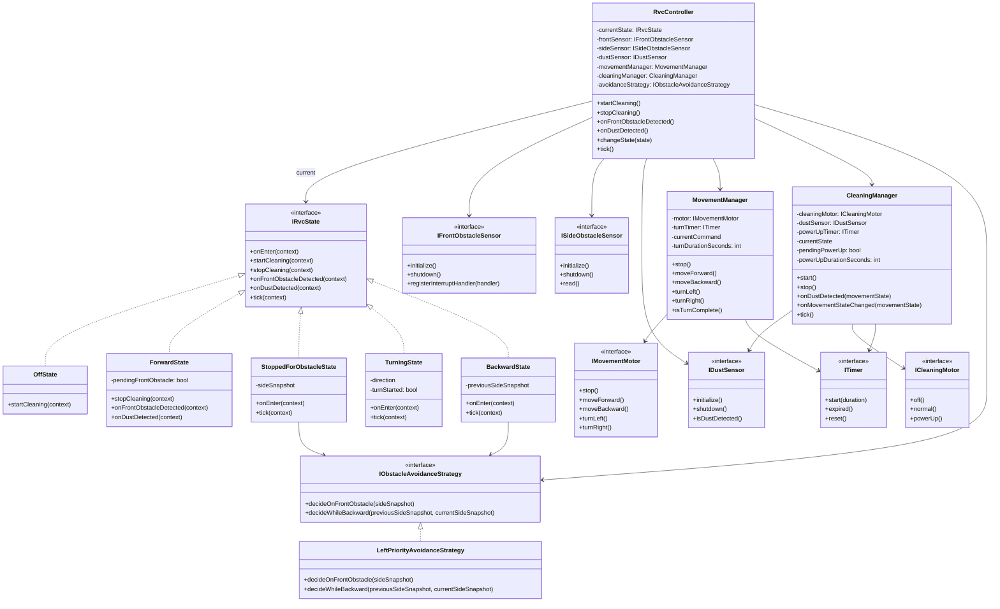
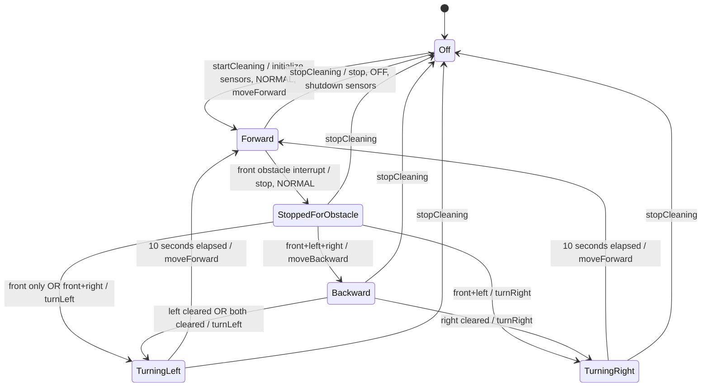
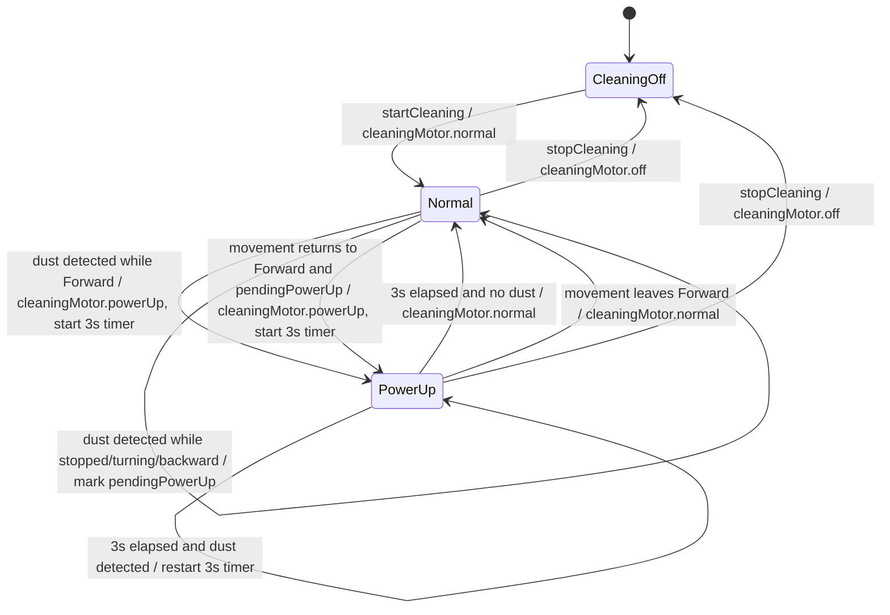
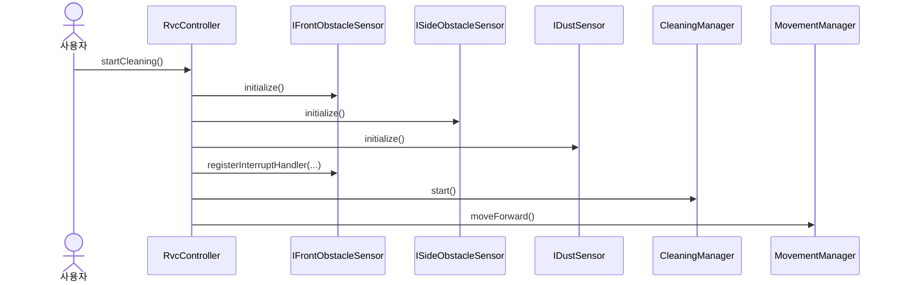
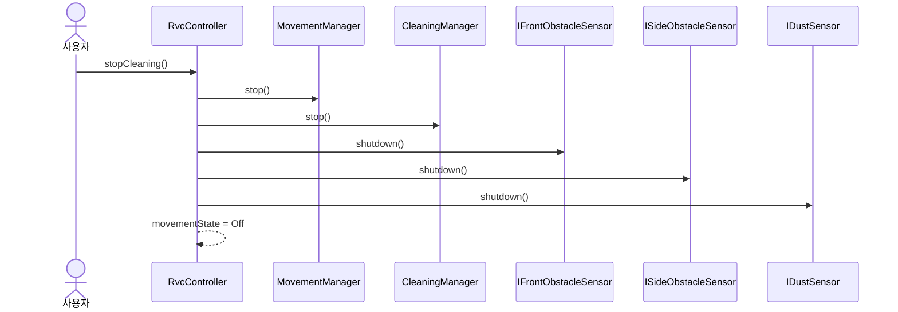
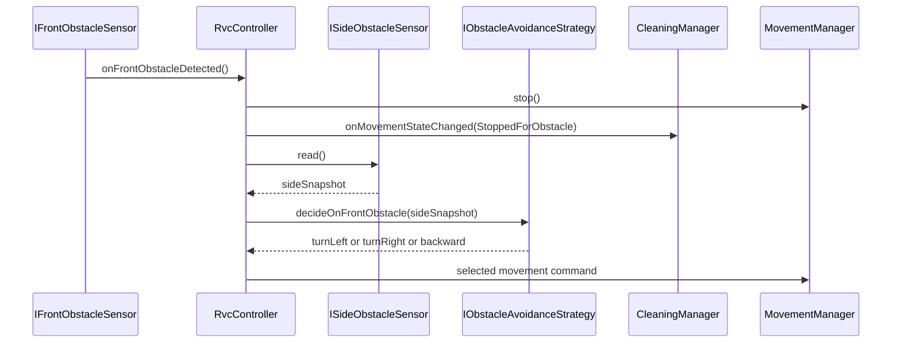
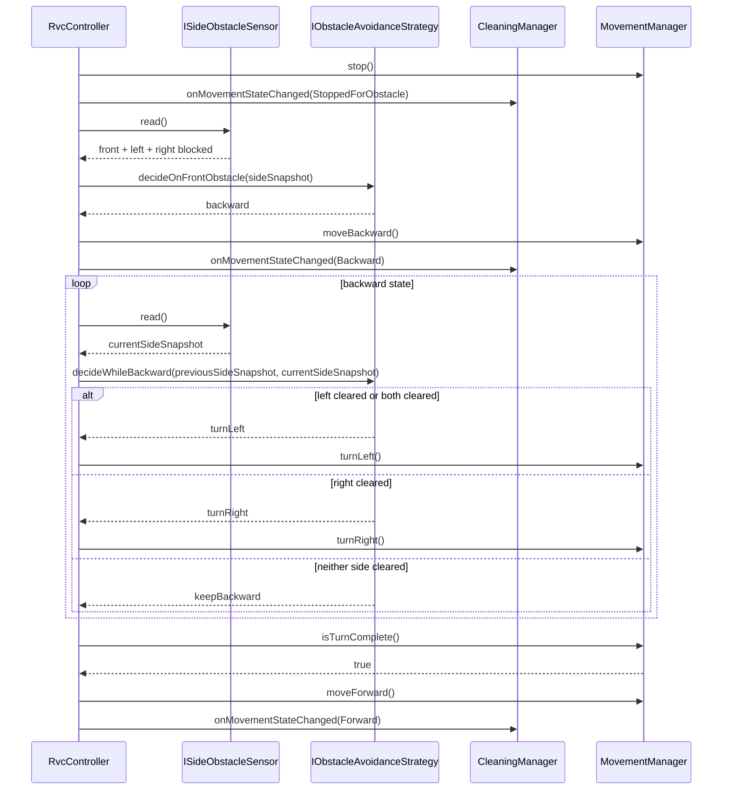
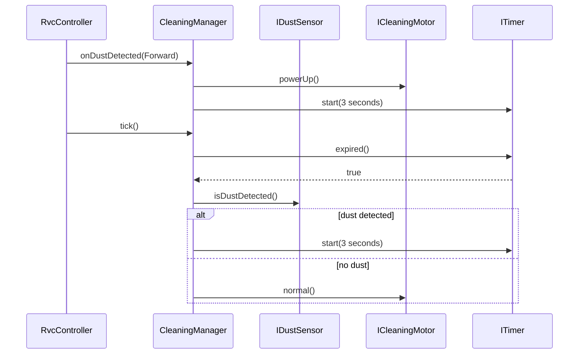
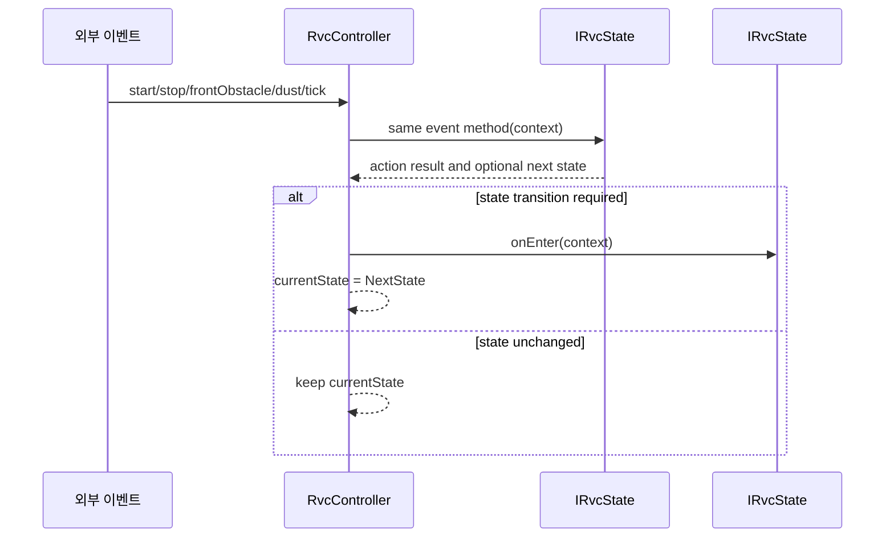

# RVC Controller Design Specification

## 1. 현재 단계

현재 단계는 Design이다. 본 문서는 요구사항 분석 산출물을 바탕으로 `rvc-controller`의 객체지향 설계를 정의한다.

## 2. 설계 범위

설계 대상은 `rvc-controller` 내부 소프트웨어 구조이다. 실제 센서 하드웨어, movement motor, cleaning motor는 외부 actor이며, controller는 추상 인터페이스를 통해서만 상호작용한다.

## 3. 설계 목표

- 센서 입력, 제어 판단, actuator 명령을 분리한다.
- 장애물 회피 동작을 명시적인 상태 머신으로 표현한다.
- 이동 명령 관리와 청소 흡입 관리를 균형 있게 분리한다.
- 실제 하드웨어 세부사항에 의존하지 않는 인터페이스를 정의한다.
- 요구사항 ID와 설계 요소 사이의 추적성을 유지한다.

## 4. 주요 설계 결정

| ID | 결정 | 근거 |
|---|---|---|
| DD-001 | `RvcController`를 최상위 조정 객체로 둔다. | 청소 시작/종료, 센서 초기화/종료, 이동/흡입 제어를 하나의 시스템 바운더리에서 조정해야 한다. |
| DD-002 | 이동 상태와 청소 흡입 상태를 별도 manager가 관리한다. | 이동 상태 전이와 cleaning motor 제어는 함께 조정되어야 하지만 책임은 분리되어야 하기 때문이다. |
| DD-003 | 장애물 판단은 Strategy 패턴으로 분리한다. | 후진 필요 여부, 회전 방향 결정, 후진 중 해제 방향 선택 규칙을 교체 가능한 전략으로 분리하기 위함이다. |
| DD-004 | 청소 흡입 관리는 `CleaningManager`로 분리한다. | 3초 POWER_UP 유지, 재감지 시 타이머 재시작, 회피 중 먼지 감지 지연 처리를 cleaning motor 관점에서 다루기 위함이다. |
| DD-005 | 시간 의존 동작은 `Timer` 인터페이스로 추상화한다. | 회전 10초, POWER_UP 3초 규칙을 테스트 가능하게 만들기 위함이다. |
| DD-006 | 이동 동작은 State 패턴으로 표현한다. | RVC가 현재 상태 객체 하나를 보유하고, 같은 이벤트 인터페이스를 통해 상태별 동작을 다르게 수행하도록 하기 위함이다. |
| DD-007 | 이동 motor 명령은 `MovementManager`로 분리한다. | 상태 객체가 실제 movement motor 인터페이스에 직접 의존하지 않고 이동 의도를 전달하도록 하기 위함이다. |

## 5. 모듈 구성

| 모듈 | 책임 |
|---|---|
| Controller Core | 전체 상태 전이 조정, 사용자 시작/종료 이벤트 처리 |
| Movement States | 이동 상태별 이벤트 처리와 상태 전이 캡슐화 |
| Sensor Interfaces | 전방/측면/먼지 센서 하드웨어와의 추상 입력 경계 |
| Motor Interfaces | movement motor, cleaning motor로 나가는 추상 명령 경계 |
| Obstacle Avoidance Strategy | 장애물 조합에 따른 후진 필요 여부와 회전 방향 결정 |
| Movement Management | movement motor 명령과 회전 완료 시간 관리 |
| Cleaning Management | OFF/NORMAL/POWER_UP 청소 흡입 상태 결정 |
| Timing | 회전 완료 시간과 POWER_UP 유지 시간 판단 |

## 6. 클래스 책임

| 클래스/인터페이스 | 책임 |
|---|---|
| `RvcController` | 청소 시작/종료, 센서 초기화/종료, 현재 이동 상태 객체 보유, 하위 객체 조정 |
| `IRvcState` | 이동 상태별 공통 이벤트 인터페이스 정의 |
| `OffState` | OFF 상태에서 청소 시작 이벤트 처리 |
| `ForwardState` | 전진 중 전방 장애물, 먼지 감지, 종료 이벤트 처리 |
| `StoppedForObstacleState` | 장애물 감지 후 정지 상태에서 회피 전략 결과에 따른 상태 전이 처리 |
| `TurningState` | 좌회전/우회전 중 10초 완료 이벤트 처리 |
| `BackwardState` | 후진 중 측면 센서 polling 결과에 따른 회전 전이 처리 |
| `IObstacleAvoidanceStrategy` | 장애물 조합에 따른 후진 필요 여부와 회전 방향 결정 인터페이스 |
| `LeftPriorityAvoidanceStrategy` | 좌회전 우선 요구사항을 반영한 기본 회피 전략 |
| `MovementManager` | movement motor 명령, 회전 10초 타이머, 이동 완료 판단 관리 |
| `CleaningManager` | 흡입 상태 전이, POWER_UP 타이머, 회피 중 먼지 감지 지연 처리 |
| `IFrontObstacleSensor` | 전방 장애물 interrupt 입력을 controller에 전달 |
| `ISideObstacleSensor` | 좌측/우측 장애물 값을 polling 방식으로 제공 |
| `IDustSensor` | 먼지 감지 값을 제공 |
| `IMovementMotor` | 전진, 정지, 후진, 좌회전, 우회전 명령 수신 |
| `ICleaningMotor` | OFF, NORMAL, POWER_UP 흡입 명령 수신 |
| `ITimer` | 3초/10초 경과 여부를 추상화 |

## 7. 클래스 다이어그램

`RvcController`는 외부 actor로부터 들어온 이벤트를 현재 `IRvcState` 객체에 위임한다. 각 concrete state는 동일한 인터페이스를 구현하지만, 현재 상태에 맞는 동작과 다음 상태 전이를 다르게 수행한다.

## 8. 인터페이스 설계

### 8.1 센서 인터페이스

| 인터페이스 | 주요 동작 | 관련 요구사항 |
|---|---|---|
| `IFrontObstacleSensor` | 초기화, 종료, 전방 장애물 interrupt handler 등록 | RVC-FR-004, RVC-FR-006, RVC-FR-032, RVC-FR-033 |
| `ISideObstacleSensor` | 초기화, 종료, 좌우 장애물 값 polling | RVC-FR-005, RVC-FR-007, RVC-FR-011 ~ RVC-FR-014, RVC-FR-032, RVC-FR-033 |
| `IDustSensor` | 초기화, 종료, 먼지 감지 값 제공 | RVC-FR-025 ~ RVC-FR-029, RVC-FR-032, RVC-FR-033 |

### 8.2 Actuator 인터페이스

| 인터페이스 | 주요 동작 | 관련 요구사항 |
|---|---|---|
| `IMovementMotor` | 정지, 전진, 후진, 좌회전, 우회전 명령 | RVC-FR-003, RVC-FR-008 ~ RVC-FR-016, RVC-FR-030 |
| `ICleaningMotor` | OFF, NORMAL, POWER_UP 흡입 명령 | RVC-FR-017 ~ RVC-FR-029, RVC-FR-031 |

### 8.3 State 패턴 인터페이스

`RvcController`는 현재 이동 상태를 나타내는 `IRvcState` 객체 하나를 보유한다. 사용자 입력, 전방 장애물 interrupt, 먼지 감지, 주기적 tick 이벤트는 모두 현재 상태 객체의 동일한 인터페이스로 위임된다.

| 상태 클래스 | 주요 책임 | 관련 요구사항 |
|---|---|---|
| `OffState` | 청소 시작 시 센서 초기화, NORMAL 흡입, 전진 상태 전이 시작 | RVC-FR-001, RVC-FR-021, RVC-FR-022, RVC-FR-032 |
| `ForwardState` | 전방 장애물 interrupt와 전진 중 먼지 감지 처리 | RVC-FR-003, RVC-FR-004, RVC-FR-025 |
| `StoppedForObstacleState` | 측면 센서 값을 읽고 회피 전략에 따라 회전 또는 후진으로 전이 | RVC-FR-008 ~ RVC-FR-011 |
| `TurningState` | 좌회전/우회전 명령 후 10초 경과 시 전진으로 전이 | RVC-FR-015, RVC-FR-016 |
| `BackwardState` | 후진 중 측면 센서를 polling하고 장애물이 해제된 방향으로 전이 | RVC-FR-011 ~ RVC-FR-014 |

### 8.4 Strategy 패턴 인터페이스

`IObstacleAvoidanceStrategy`는 장애물 발견 후 회피가 필요할 때 후진 필요 여부와 회전 방향을 결정한다. 기본 전략은 `LeftPriorityAvoidanceStrategy`이며, 요구사항의 좌회전 우선 규칙을 반영한다.

| 전략 메서드 | 결정 내용 | 관련 요구사항 |
|---|---|---|
| `decideOnFrontObstacle(sideSnapshot)` | 전방 장애물 감지 후 좌우 센서 조합에 따라 좌회전, 우회전, 후진 중 하나를 결정 | RVC-FR-008 ~ RVC-FR-011 |
| `decideWhileBackward(previousSideSnapshot, currentSideSnapshot)` | 후진 중 좌우 장애물 해제 상태에 따라 좌회전, 우회전, 후진 유지 중 하나를 결정 | RVC-FR-012 ~ RVC-FR-014 |

## 9. 이동 상태 머신

이동 상태 머신은 State 패턴으로 구현 가능한 형태로 설계한다. 상태 다이어그램의 각 상태는 `IRvcState`의 구체 상태 클래스에 대응한다.

### 9.1 이동 상태

| 상태 | 의미 |
|---|---|
| `Off` | 시스템 OFF 상태 |
| `Forward` | 전진 청소 상태 |
| `StoppedForObstacle` | 전방 장애물 감지 후 정지한 상태 |
| `TurningLeft` | 좌회전 중 상태 |
| `TurningRight` | 우회전 중 상태 |
| `Backward` | 삼방향 장애물 감지 후 후진 중 상태 |

### 9.2 이동 상태 다이어그램

### 9.3 종료 입력 설계 보류

`RVC-TBD-004`에 따라 회전, 후진, POWER_UP 중 청소 종료 버튼 입력이 발생했을 때 즉시 OFF로 전환하는지 여부는 요구사항에서 아직 확정되지 않았다. 본 설계 다이어그램은 안전한 기본 후보로 모든 이동 상태에서 `stopCleaning` 이벤트를 받을 수 있게 표현했지만, 최종 구현 전 요구사항 확정이 필요하다.

## 10. 청소 흡입 상태 머신

### 10.1 청소 흡입 상태

| 상태 | 의미 |
|---|---|
| `CleaningOff` | 전체 시스템 OFF로 인해 흡입 정지 |
| `Normal` | 기본 흡입 상태 |
| `PowerUp` | 먼지 감지 후 3초 유지되는 강화 흡입 상태 |

### 10.2 청소 흡입 상태 다이어그램

## 11. 주요 상호작용 설계

### 11.1 SD-001 청소 시작

### 11.2 SD-002 청소 종료

### 11.3 SD-003 전방 장애물 회피

### 11.4 SD-004 삼방향 장애물 탈출

### 11.5 SD-005 POWER_UP 유지

### 11.6 State 이벤트 위임 구조

## 12. 요구사항-설계 추적표

| 요구사항 | 설계 요소 |
|---|---|
| RVC-FR-001, RVC-FR-021, RVC-FR-022 | `RvcController.startCleaning`, SD-001 |
| RVC-FR-002, RVC-FR-020 | `RvcController.stopCleaning`, 이동/청소 흡입 상태의 `Off` 전이, SD-002 |
| RVC-FR-003 | 이동 상태 `Forward`, `MovementManager.moveForward` |
| RVC-FR-004 ~ RVC-FR-007 | `IFrontObstacleSensor`, `ISideObstacleSensor`, `IObstacleAvoidanceStrategy`, SD-003, SD-004 |
| RVC-FR-008 ~ RVC-FR-016 | 이동 상태 머신, `IRvcState`, `IObstacleAvoidanceStrategy`, `MovementManager`, `IMovementMotor`, SD-003, SD-004 |
| RVC-FR-017 ~ RVC-FR-029 | 청소 흡입 상태 머신, `CleaningManager`, `ICleaningMotor`, `ITimer`, SD-005 |
| RVC-FR-030 | `MovementManager`, `IMovementMotor` |
| RVC-FR-031 | `CleaningManager`, `ICleaningMotor` |
| RVC-FR-032, RVC-FR-033 | 센서 인터페이스 `initialize`, `shutdown`, SD-001, SD-002 |
| RVC-NFR-001 | 모든 외부 하드웨어 의존성은 인터페이스 뒤에 배치 |
| RVC-NFR-003 | Sensor Interfaces, Controller Core, Motor Interfaces, Movement Management, Cleaning Management 분리 |

## 13. 미확정 요구사항의 설계 영향

| 미정 항목 | 설계 영향 |
|---|---|
| RVC-TBD-001 후진 중 좌우 센서 polling 주기 | `Backward` 상태에서 `tick()` 또는 주기 이벤트로 처리 가능하도록 열어둔다. |
| RVC-TBD-002 후진 장시간 지속 예외 처리 | 현재 상태 머신에는 timeout 전이를 넣지 않는다. 향후 `Backward` 상태에 timeout 전이를 추가할 수 있다. |
| RVC-TBD-003 360도 회전 탈출 기능 | 현재 설계에는 포함하지 않는다. 향후 별도 이동 상태로 확장 가능하다. |
| RVC-TBD-004 종료 입력 우선순위 | 설계 다이어그램에는 모든 이동 상태에서 종료 이벤트 후보를 표시했으나, 구현 전 최종 확정이 필요하다. |
