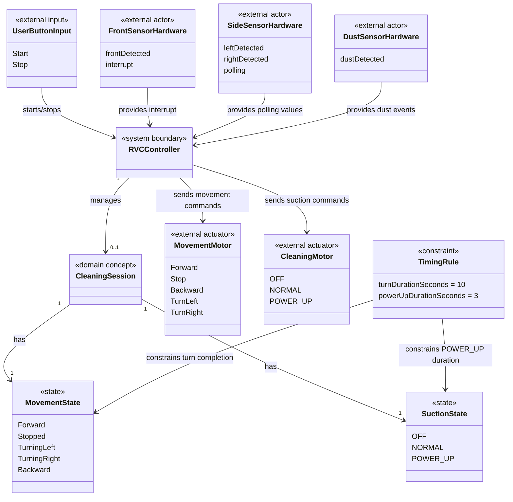

# RVC Domain Model

## 현재 단계

현재 단계는 Requirements Analysis 이후의 분석 모델 정리이다. 본 문서는 구현 클래스를 정의하지 않고, 요구사항에서 식별되는 도메인 개념과 관계를 표현한다. 시스템 바운더리는 `rvc-controller`이며, 실제 센서 하드웨어와 actuator는 외부 actor로 둔다.

## 도메인 개념

| 개념 | 설명 |
|---|---|
| RVC Controller | 자동 진공 청소 제어 대상 시스템 |
| 사용자 버튼 입력 | 청소 시작 및 종료를 발생시키는 사용자 입력 |
| 청소 세션 | 시작 버튼 입력 후 종료 버튼 입력 전까지의 자동 청소 수행 구간 |
| 이동 상태 | 전진, 정지, 좌회전, 우회전, 후진과 같은 RVC의 이동 관련 상태 |
| 흡입 상태 | OFF, NORMAL, POWER_UP으로 구분되는 진공 흡입 상태 |
| 전방 센서 하드웨어 | 전방 장애물 interrupt 입력을 제공하는 외부 actor |
| 측면 센서 하드웨어 | 좌측 및 우측 장애물 polling 입력을 제공하는 외부 actor |
| 먼지 센서 하드웨어 | 먼지 감지 여부를 제공하는 외부 actor |
| Movement Motor | 이동 명령을 수신하는 외부 actuator |
| Cleaning Motor | 흡입 명령을 수신하는 외부 actuator |
| 회전 완료 시간 | 회전 모드 진입 후 회전 완료로 간주하기까지의 시간 |
| POWER_UP 유지 시간 | 먼지 감지 후 POWER_UP을 유지하는 시간 |

## 도메인 모델 다이어그램

## 도메인 규칙 요약

| 규칙 ID | 도메인 규칙 |
|---|---|
| DR-001 | 청소 세션은 사용자 시작 입력으로 생성되고 사용자 종료 입력으로 종료된다. |
| DR-002 | 청소 세션 중 기본 이동 상태는 전진이다. |
| DR-003 | 전방 장애물이 없는 경우 좌우 장애물 입력은 회피 판단에 영향을 주지 않는다. |
| DR-004 | 좌회전은 기본 우선 회전 방향이다. |
| DR-005 | 회전 상태는 10초 후 완료된 것으로 간주된다. |
| DR-006 | 정지, 회전, 후진 중 흡입 상태는 NORMAL이다. |
| DR-007 | 전진 중 먼지가 감지되면 흡입 상태는 POWER_UP이다. |
| DR-008 | POWER_UP은 3초 후 먼지 재확인 결과에 따라 유지되거나 NORMAL로 복귀한다. |
| DR-009 | 실제 센서 하드웨어와 actuator는 `rvc-controller` 바운더리 밖의 외부 actor이다. |
