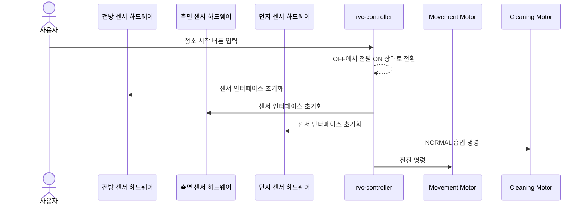
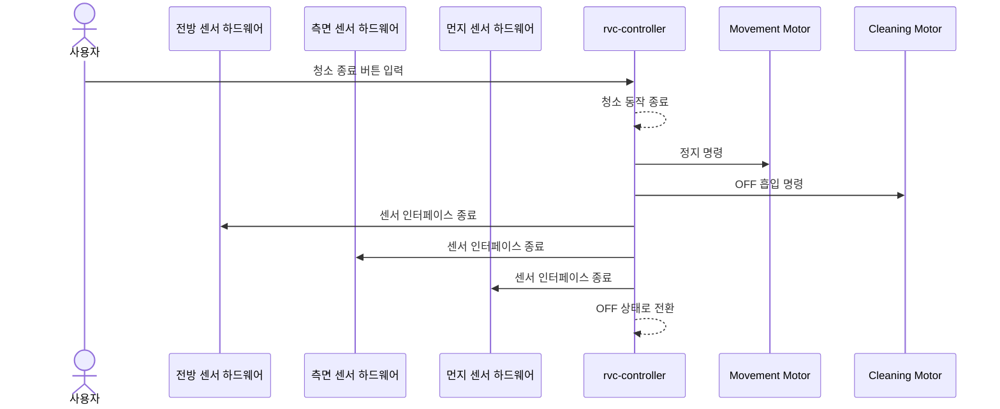
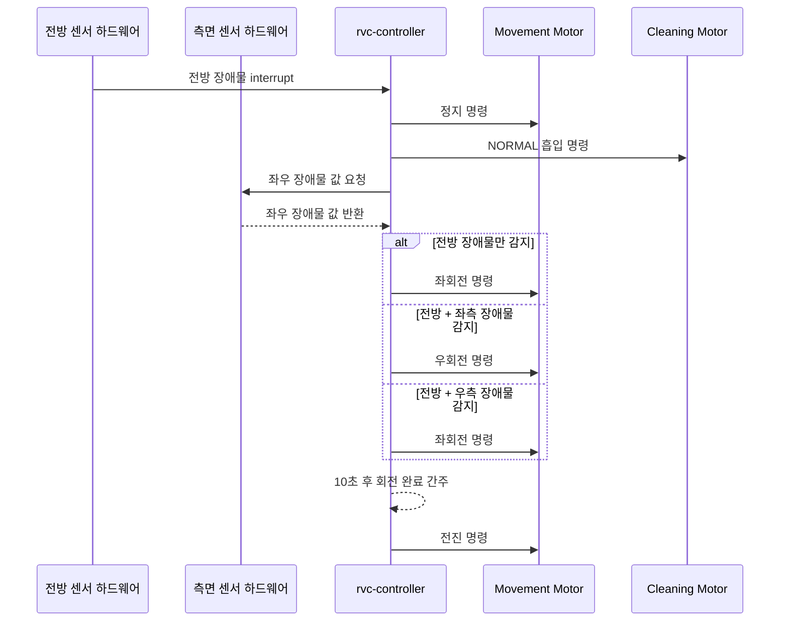
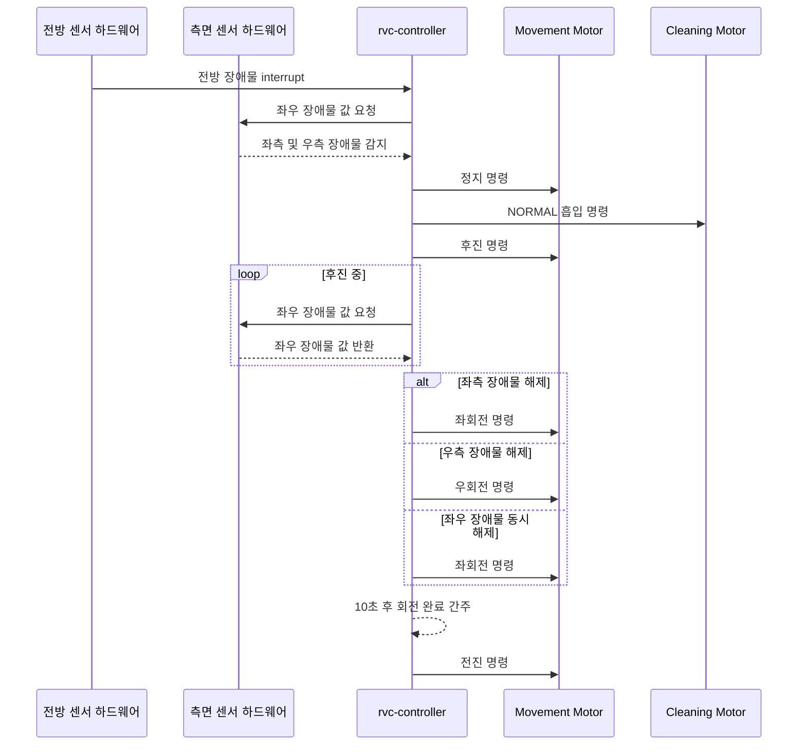
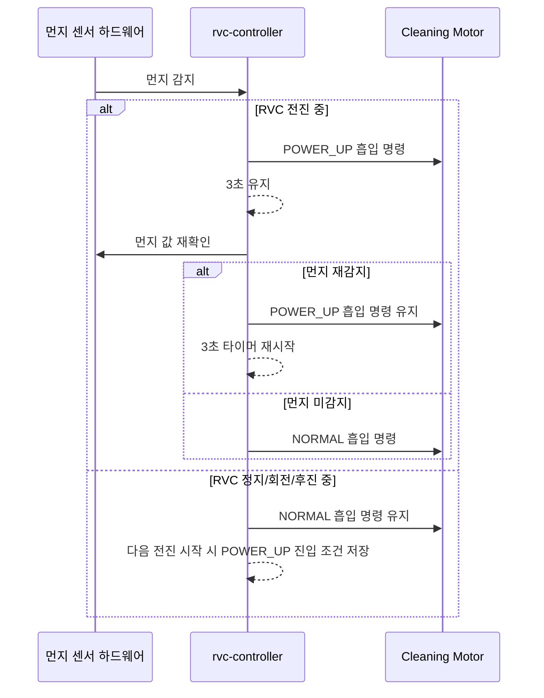

# RVC System Sequence Diagrams

## 현재 단계

현재 단계는 Requirements Analysis 이후의 분석 모델 정리이다. 본 문서는 외부 actor와 `rvc-controller` 사이의 시스템 수준 이벤트 순서를 표현한다.

## SSD-001 자동 진공 청소 시작

## SSD-002 자동 진공 청소 종료

## SSD-003 전방 장애물 회피

## SSD-004 삼방향 장애물 탈출

## SSD-005 먼지 감지에 따른 흡입 강화

