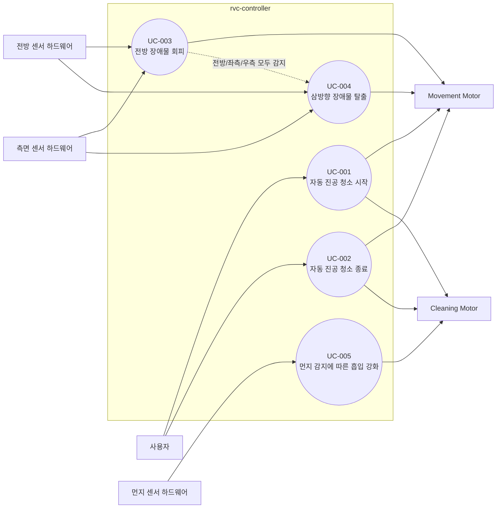

# RVC Use Case Diagram

## 현재 단계

현재 단계는 Requirements Analysis이다. 본 문서는 `rvc-controller`의 자동 진공 청소 제어 로직 유스케이스 다이어그램을 정의한다.

```mermaid
flowchart LR
    User[사용자]
    FrontSensor[전방 센서 하드웨어]
    SideSensor[측면 센서 하드웨어]
    DustSensor[먼지 센서 하드웨어]
    MoveMotor[Movement Motor]
    CleanMotor[Cleaning Motor]

    subgraph RVC[rvc-controller]
        UC1((UC-001<br/>자동 진공 청소 시작))
        UC2((UC-002<br/>자동 진공 청소 종료))
        UC3((UC-003<br/>전방 장애물 회피))
        UC4((UC-004<br/>삼방향 장애물 탈출))
        UC5((UC-005<br/>먼지 감지에 따른 흡입 강화))
    end

    User --> UC1
    User --> UC2
    FrontSensor --> UC3
    SideSensor --> UC3
    FrontSensor --> UC4
    SideSensor --> UC4
    DustSensor --> UC5
    UC1 --> MoveMotor
    UC1 --> CleanMotor
    UC2 --> MoveMotor
    UC2 --> CleanMotor
    UC3 --> MoveMotor
    UC4 --> MoveMotor
    UC5 --> CleanMotor

    UC3 -. 전방/좌측/우측 모두 감지 .-> UC4
```
